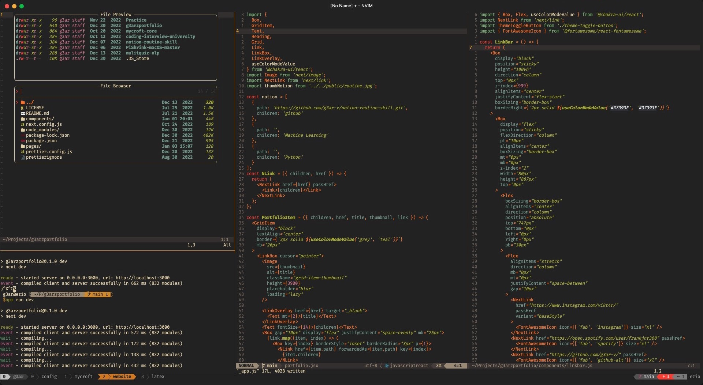

    

# My dotfile setup

This repo hosts my Nvim configuration for Linux and macOS. Also configuration
of programs both used on Linux/macOS and other operating systems.
`init.lua` is the config entry point for terminal Nvim, `plugins.lua`
contains list of plugins,`maps.lua` customizable key mappings.

## Neovim Plugins

- Plugin management via [Packer.nvim](https://github.com/wbthomason/packer.nvim).
- File tree explore [telescope.nvim](https://github.com/nvim-telescope/telescope.nvim)
- A high performance color highlighter [colorizer.lua](https://github.com/norcalli/nvim-colorizer.lua)
- Code highlighting, indentation, folding [nvim-treesitter](https://github.com/nvim-treesitter/nvim-treesitter).
- Faster code commenting [vim-commentary](https://github.com/tpope/vim-commentary).
- A snazzy bufferline [bufferline.nvim](https://github.com/akinsho/bufferline.nvim).
- Code, snippet, word auto-completion via [nvim-cmp](https://github.com/hrsh7th/nvim-cmp).
- Language server protocol (LSP) support via [nvim-lspconfig](https://github.com/neovim/nvim-lspconfig).
- Git integration via [vim-fugitive](https://github.com/tpope/vim-fugitive).
- Faster matching pair insertion and jump via [delimitMate](https://github.com/Raimondi/delimitMate).
- Smarter and faster matching pair management (add, replace or delete) via [vim-sandwich](https://github.com/machakann/vim-sandwich).
- Powerful snippet insertion via [Ultisnips](https://github.com/SirVer/ultisnips).
- Aesthetic statusline [lualine.nvim](https://github.com/nvim-lualine/lualine.nvim).
- Better quickfix list with [nvim-bqf](https://github.com/kevinhwang91/nvim-bqf).
- Show search index and count with [nvim-hlslens](https://github.com/kevinhwang91/nvim-hlslens).
- Command line auto-completion via [wilder.nvim](https://github.com/gelguy/wilder.nvim).
- User-defined mapping hint via [which-key.nvim](https://github.com/folke/which-key.nvim).
- Beautiful colorscheme via [sainnhe/gruvbox-material](https://github.com/sainnhe/gruvbox-material) and other colorschemes.
- Markdown writing and previewing via [marksman](from mason.nvim) and [markdown-preview.nvim](https://github.com/iamcco/markdown-preview.nvim).
- LaTeX editing and previewing via [vimtex](https://github.com/lervag/vimtex)
- Animated GUI style notification via [nvim-notify](https://github.com/rcarriga/nvim-notify).
- Monitor coding activity [vim-wakatime](https://github.com/wakatime/vim-wakatime).
- VSCode-like pictograms for neovim [lspkind-nvim](https://github.com/onsails/lspkind.nvim).
<!-- - Query `Dash.app` with neovim [dash.nvim](https://github.com/mrjones2014/dash.nvim). -->

## Shell setup for Mac/Linux

- [hyper](https://hyper.is/) for Mac
- [alacritty](https://github.com/alacritty/alacritty.git) for Linux
- [zsh](https://github.com/z-shell) shell used for both OS
- [Nerd fonts](https://github.com/ryanoasis/nerd-fonts) powerline-patched fonts. font used is FiraCode
- [z](https://github.com/rupa/z.git) directory jumping
- [Exa](https://the.exa.website/) aesthetic and detailed `ls`
- [Gruvbox](https://github.com/morhetz/gruvbox.git) gruvbox for shell theme. setup is in [hyper.js](https://github.com/g3ar-v/dot-files/blob/master/.hyper.js)
- [zathura]() PDF reader with dark-theme and minimal.

# Reference (inspiration)

- craftzdog's nvim config [here](https://github.com/craftzdog/dotfiles-public/tree/master/.config/nvim)
- jdhao's config [here](https://github.com/jdhao/nvim-config).
