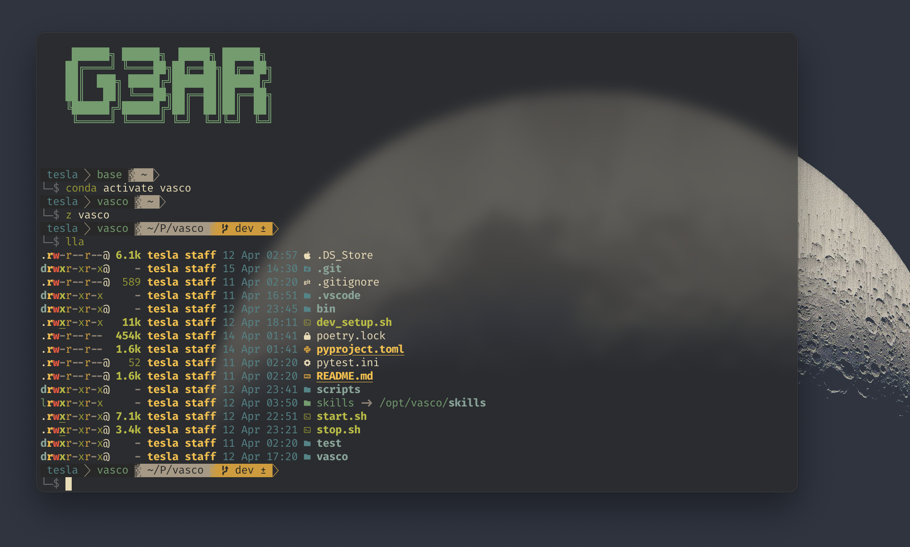
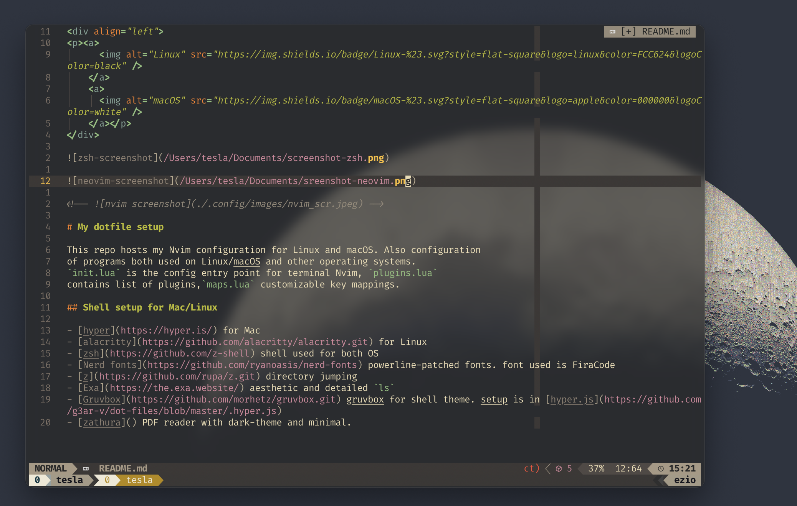

    

# My dotfile setup

This repo hosts my Nvim configuration for Linux and macOS. Also configuration
of programs both used on Linux/macOS and other operating systems.
`init.lua` is the config entry point for neovim terminal.

## Shell setup for Mac/Linux

- [hyper](https://hyper.is/) - Mac
- [iterm2](https://iterm2.com/) - **Mac**
- [alacritty](https://github.com/alacritty/alacritty.git) - Linux
- [LazyVim](https://www.lazyvim.org/) - lazyVim requires NeoVim >= **0.8.0**
- [zsh](https://github.com/z-shell) - shell used for both OS
- [Nerd fonts](https://github.com/ryanoasis/nerd-fonts) - powerline-patched fonts. font used is FiraCode
- [z](https://github.com/rupa/z.git) - directory jumping
- [Eza](https://github.com/eza-community/eza) - `ls` replacement
- [Gruvbox](https://github.com/morhetz/gruvbox.git) - gruvbox for shell theme.

## Loading iTerm2 preference

- In iTerm2, navigate to the Preferences window (iTerm2 > Preferences) and go to the General tab.
- Towards the bottom of the window, check the option "Load preferences from a custom folder or URL".
- Set, save changes to manually.
- Upon restarting iTerm2, preference changes should update.
- Now set save changes to automatically or you choice.
